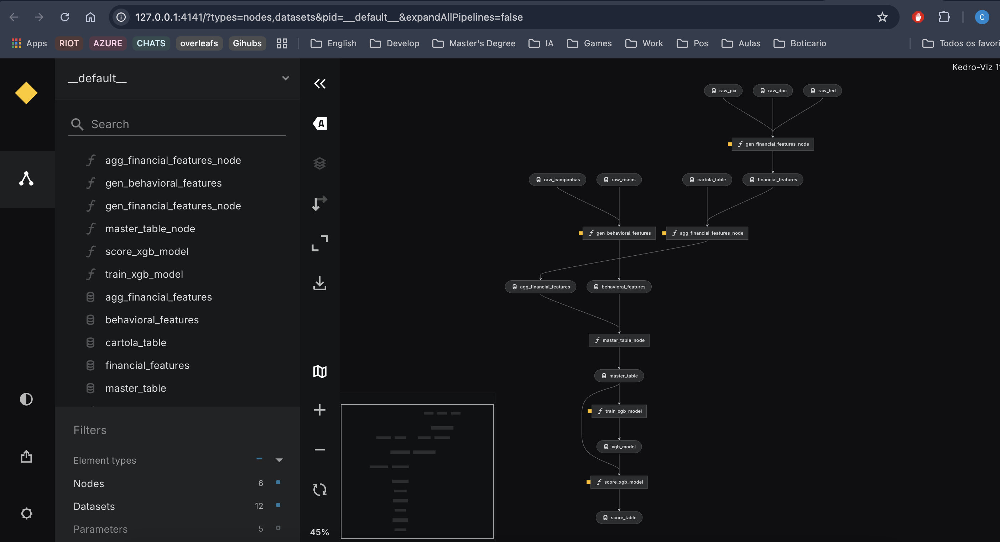
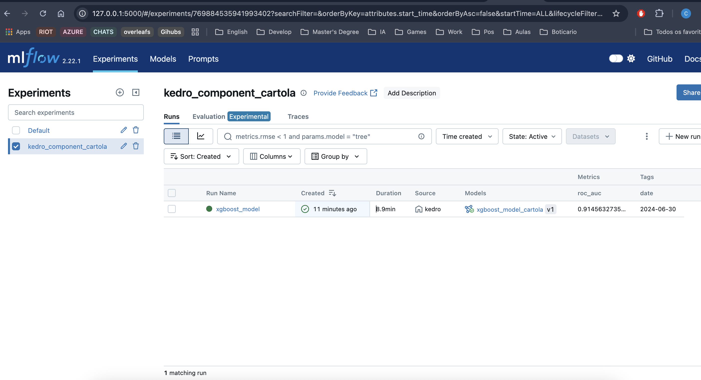

# Exemplo de Pipeline de ML

Baseado num projeto de Machine Learning voltando para identificação de inadimplência e sugestão de campanhas (WIP). Utiliza do framework Kedro rodando localmente para processamento de dados, e treinamento e scoragem de um modelo simples de predição.

## Resultado

## Comandos úteis

Na pasta kedro-component-cartola. Para execucção da pipeline

$ kedro run

Para visualização da pipeline:

$ kedro viz

Para acesso ao Mlflow:

$ kedro mlflow ui

